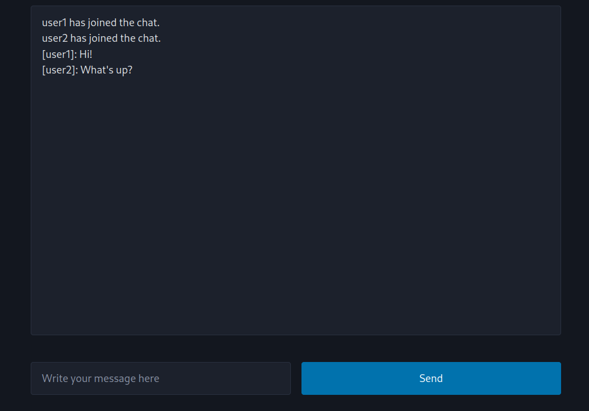

# Real-time chat application service in Rust

> A mixed programming language project using Rust for the chat server
backend and TypeScript+React for the frontend.

The Docker deployment consist of the following:
- Separate Docker container for backend
- Separate Docker container for frontend
- Deployment runs in its own Docker network



## How to build and run

### With `docker-compose`

If `docker-compose` is installed, build and run the service with the following command:

```sh
docker compose up
```

### With GNU Make

Build the Docker images by calling the `Makefile` with `make`. This will also create the `chatservice-network` Docker network.

```sh
make
```

Run the backend container with

```sh
make runBackend
```

Then run the frontend container with

```sh
# In another terminal window
make runBackend
```

### Local build

Build and run the server in `backend/`:

```
cd backend
cargo run --release
```

Then build and run the frontend in `frontend/`:

```
# In another terminal window
cd frontend
npm run start
```

## How to use

There is no command-line interface.

1. Open a web browser and navigate to `localhost:8000`. Enter your user name.
2. Open a new browser window or tab for `localhost:8000` and join as another user to the chat.
   Each new browser window and browser tab acts as a separate chat client connection.
3. Closing the browser window or tab disconnects the client and other clients in the chat will be
   notified about it.
4. When using Docker, press CTRL+C to terminate the container that runs in the
   foreground, ending both backend and frontend.

You can access the following REST API endpoints (make sure to include `/api` in the URLs):
- Health endpoint: `GET http://localhost:8000/api/health`
- Message and activity history of current chat: `GET http://localhost:8000/api/history`

The REST endpoints are proxied by the frontend and are used for functionality.

## Tech stack

- Backend: Rust
  - [tokio](https://tokio.rs/): asynchronous runtime and TCP network layer
  - [tokio-tungstenite](https://github.com/snapview/tokio-tungstenite): WebSocket library
    (Found on [Are We Web Yet?](https://www.arewewebyet.org/topics/lower-web-stack/).
    There's also `rust-websocket`,
    but it's unmaintained and the maintainers recommend `tokio-tungstenite` too
    instead. Note that there's also a WebSocket module in `actix-web`.)
  - [actix-web](https://actix.rs/): web framework for REST API endpoints
  - [serde](https://serde.rs/): serialization library used for JSON payloads
- Frontend: TypeScript, React
  - [Vite](https://vite.dev/): build tool and additional proxy routing of REST API endpoints
  - [Pico CSS](https://picocss.com/): a lightweight CSS framework for making
    quick prototypes and demonstrations
  - [WebSocket API](https://developer.mozilla.org/en-US/docs/Web/API/WebSockets_API)
    (Socket.IO library was considered, but that uses it's own custom handshake mechanism
    that is not compatible with the low-level WebSocket handling in Rust.)

## TODO

- Introduce authentication.
- Make it a distributed service using load balancer, multiple service replicas and a separate in-memory store (Redis or Memcached).
